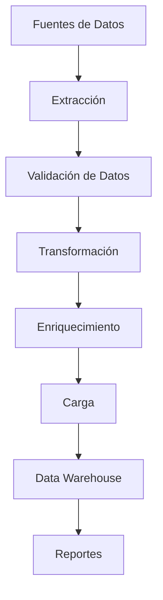
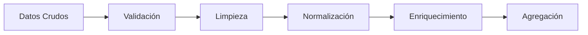
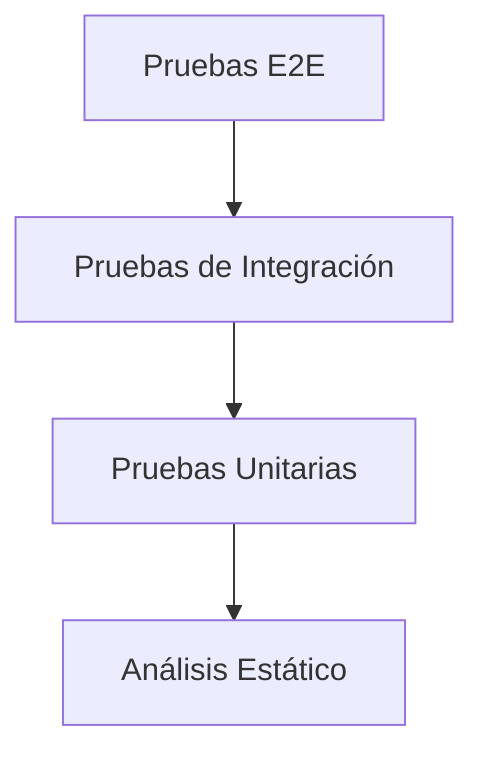
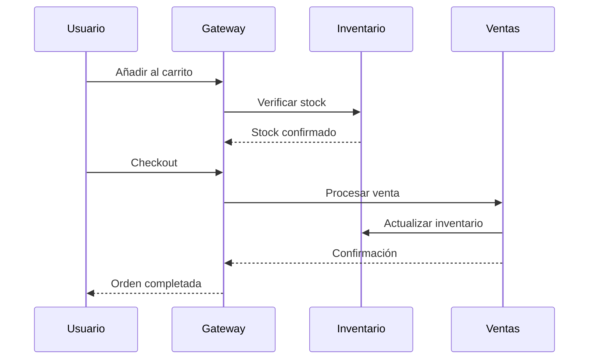
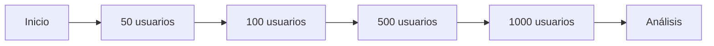
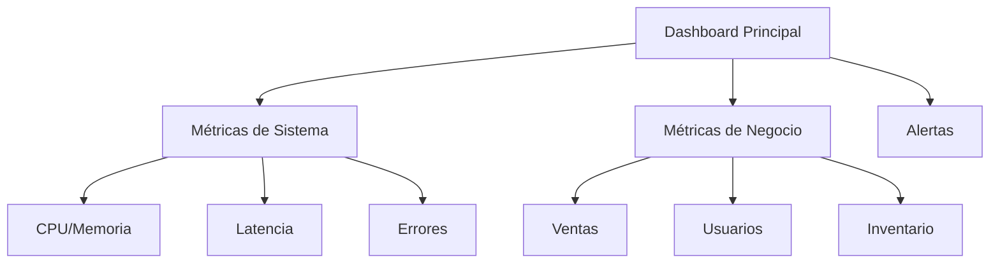

# Documentación Técnica del Sistema ElectroPluz
Autor: [Tu Nombre]
Fecha: 16 de octubre de 2025
Versión: 1.0

## Resumen Ejecutivo
El presente documento detalla la arquitectura, implementación y plan de pruebas del sistema ElectroPluz, una plataforma de comercio electrónico desarrollada utilizando una arquitectura de microservicios. El sistema está diseñado para manejar inventario, procesar ventas y proporcionar una interfaz de usuario robusta y escalable.

## Índice
1. Arquitectura del Sistema
2. Proceso ETL
3. Plan de Pruebas
4. Monitoreo y Mantenimiento
5. Procedimientos de Despliegue
6. Contacto y Soporte

## 1. Arquitectura del Sistema

### 1.1 Visión General
El sistema ElectroPluz implementa una arquitectura de microservicios distribuida, siguiendo los principios SOLID y patrones de diseño empresarial. La arquitectura está diseñada para garantizar:

- Alta disponibilidad (99.9%)
- Escalabilidad horizontal
- Mantenibilidad
- Seguridad de datos
- Consistencia transaccional

### 1.2 Componentes Principales

El sistema está compuesto por tres microservicios principales:

1. **ElectroPlus-Gateway-New**
   - Actúa como punto de entrada principal
   - Gestiona autenticación y autorización
   - Maneja la interfaz de usuario y dashboard
   - Implementa el carrito de compras

2. **ElectroPlus-M-Inventario**
   - Gestión completa del inventario
   - Control de productos y categorías
   - Sistema de cupones
   - Reportes de inventario

3. **ElectroPlus-M-Ventas**
   - Procesamiento de ventas
   - Registro de transacciones
   - Reportes de ventas

### 1.3 Stack Tecnológico

#### 1.3.1 Backend
- **Framework Principal**: Django 4.2
  - Razón de elección: Robustez, seguridad integrada, ORM potente
  - Ventajas específicas:
    * Autenticación y autorización incorporada
    * Middleware personalizable
    * Sistema de migraciones automático

- **Lenguaje**: Python 3.11
  - Características utilizadas:
    * Type hints
    * Async/await para operaciones I/O
    * Dataclasses para modelos
    * Context managers para recursos

#### 1.3.2 Bases de Datos
- **Desarrollo**: SQLite 3
  - Ventajas:
    * Configuración zero
    * Portabilidad
    * Ideal para desarrollo y pruebas

- **Producción**: MySQL 8.0
  - Características clave:
    * Soporte para transacciones ACID
    * Índices optimizados
    * Replicación master-slave
    * Backup automatizado

#### 1.3.3 Frontend
- **Framework CSS**: Bootstrap 5.2
- **JavaScript**: 
  * ES6+ features
  * Fetch API para comunicación AJAX
  * Event Delegation para mejor rendimiento
- **Sistema de Templates**: Django Templates
  * Herencia de templates
  * Custom template tags
  * Filtros personalizados

#### 1.3.4 Herramientas de Desarrollo
- Git para control de versiones
- Docker para conteneirización
- Jenkins para CI/CD
- SonarQube para análisis de código
- PyTest para testing automatizado

## 2. Proceso ETL (Extract, Transform, Load)

### 2.1 Descripción General del Proceso ETL
El proceso ETL en ElectroPluz está diseñado para manejar grandes volúmenes de datos transaccionales y convertirlos en información útil para la toma de decisiones. El proceso se ejecuta de manera programada utilizando Django Celery para tareas asíncronas.

#### Diagrama de Flujo del Proceso ETL


### 2.2 Extracción (Extract)

#### 2.2.1 Fuentes de Datos
1. **Base de datos transaccional (Ventas)**
   - Tablas principales:
     * sales_transaction
     * sales_items
     * payment_details
   - Frecuencia de extracción: Cada 6 horas

2. **Sistema de inventario**
   - Tablas principales:
     * products
     * categories
     * stock_movements
   - Frecuencia de extracción: Diaria

3. **Registros de usuarios**
   - Tablas principales:
     * users
     * user_profiles
     * user_activities
   - Frecuencia de extracción: Diaria

4. **Logs de transacciones**
   - Formatos:
     * JSON logs
     * Server logs (nginx/apache)
     * Application logs
   - Frecuencia de extracción: Tiempo real
1. Base de datos transaccional (Ventas)
2. Sistema de inventario
3. Registros de usuarios
4. Logs de transacciones

#### Proceso de Extracción
```python
# Ejemplo de proceso de extracción
def extract_sales_data():
    # Extracción de ventas diarias
    daily_sales = Sales.objects.filter(
        date__gte=datetime.now() - timedelta(days=1)
    )
    return daily_sales

def extract_inventory_data():
    # Extracción de datos de inventario
    inventory = Product.objects.all().select_related('category')
    return inventory
```

### 2.3 Transformación (Transform)

#### 2.3.1 Arquitectura de Transformación
El proceso de transformación utiliza una arquitectura de pipeline modular que permite el procesamiento paralelo y manejo de errores robusto.



#### 2.3.2 Procesos de Transformación
1. Limpieza de datos
   - Eliminación de duplicados
   - Corrección de valores nulos
   - Normalización de formatos

2. Enriquecimiento de datos
   - Cálculo de métricas
   - Agregación de datos
   - Generación de KPIs

```python
# Ejemplo de proceso de transformación
def transform_sales_data(sales_data):
    transformed_data = {
        'daily_revenue': sum(sale.total for sale in sales_data),
        'transaction_count': sales_data.count(),
        'average_ticket': sum(sale.total for sale in sales_data) / sales_data.count() if sales_data else 0
    }
    return transformed_data
```

### 2.3 Carga (Load)

#### Destino de Datos
1. Data Warehouse
2. Sistemas de reportes
3. Dashboard analytics

```python
# Ejemplo de proceso de carga
def load_transformed_data(transformed_data):
    DailyMetrics.objects.create(
        date=datetime.now().date(),
        revenue=transformed_data['daily_revenue'],
        transactions=transformed_data['transaction_count'],
        avg_ticket=transformed_data['average_ticket']
    )
```

## 3. Plan de Pruebas

### 3.1 Metodología de Pruebas
El proceso de pruebas sigue una metodología estructurada basada en la pirámide de pruebas de Mike Cohn:



### 3.2 Herramientas de Prueba
- **Framework de Pruebas**: PyTest
- **Cobertura de Código**: Coverage.py
- **Análisis Estático**: 
  * PyLint
  * MyPy para type checking
  * Bandit para seguridad
- **Pruebas de Carga**: Apache JMeter
- **Pruebas E2E**: Selenium WebDriver

### 3.3 Pruebas Unitarias

#### Gateway
- Pruebas de autenticación
- Validación de formularios
- Funcionalidad del carrito

```python
# Ejemplo de prueba unitaria
def test_cart_add_item(self):
    product = Product.objects.create(name="Test Product", price=100)
    cart = Cart(self.client)
    cart.add(product)
    self.assertEqual(cart.get_total(), 100)
```

#### Inventario
- CRUD de productos
- Gestión de categorías
- Sistema de cupones

#### Ventas
- Procesamiento de transacciones
- Cálculo de totales
- Validación de inventario

### 3.4 Pruebas de Integración

#### 3.4.1 Casos de Prueba de Integración

##### A. Flujo de Compra Completo


1. **Flujo de Compra Completo**
   - Añadir al carrito
   - Proceso de checkout
   - Actualización de inventario
   - Registro de venta

2. **Sincronización de Servicios**
   - Comunicación entre microservicios
   - Consistencia de datos
   - Manejo de errores

### 3.5 Pruebas de Rendimiento

#### 3.5.1 Objetivos de Rendimiento
- Tiempo de respuesta < 200ms para el 95% de las peticiones
- Capacidad de manejar 1000 usuarios concurrentes
- Disponibilidad del 99.9%
- Tiempo de recuperación < 5 segundos

#### 3.5.2 Tipos de Pruebas de Rendimiento

##### A. Pruebas de Carga

   - Simulación de múltiples usuarios
   - Tiempo de respuesta bajo carga
   - Límites del sistema

2. **Pruebas de Estrés**
   - Comportamiento en límites máximos
   - Recuperación ante fallos
   - Gestión de recursos

### 3.4 Pruebas de Seguridad

1. **Autenticación y Autorización**
   - Validación de roles
   - Protección de rutas
   - Manejo de sesiones

2. **Seguridad de Datos**
   - Encriptación
   - Validación de entradas
   - Protección contra inyecciones SQL

## 4. Monitoreo y Mantenimiento

### 4.1 Estrategia de Monitoreo

#### 4.1.1 Herramientas de Monitoreo
- **APM (Application Performance Monitoring)**: New Relic
- **Log Management**: ELK Stack (Elasticsearch, Logstash, Kibana)
- **Sistema de Alertas**: PagerDuty
- **Monitoreo de Infraestructura**: Prometheus + Grafana

#### 4.1.2 Dashboard Principal


### 4.2 Métricas Clave

1. **Rendimiento**
   - Tiempo de respuesta
   - Uso de recursos
   - Tasa de errores

2. **Negocio**
   - Ventas diarias
   - Inventario
   - Satisfacción del cliente

### 4.2 Procedimientos de Mantenimiento

1. **Respaldos**
   - Bases de datos
   - Archivos de configuración
   - Logs del sistema

2. **Actualizaciones**
   - Parches de seguridad
   - Mejoras del sistema
   - Nuevas funcionalidades

## 5. Procedimientos de Despliegue

### 5.1 Ambiente de Desarrollo
```powershell
# Activar entorno virtual
.\venv\Scripts\Activate

# Instalar dependencias
pip install -r requirements.txt

# Ejecutar migraciones
python manage.py migrate

# Iniciar servicios
.\start_services.ps1
```

### 5.2 Ambiente de Producción
1. Verificación de dependencias
2. Respaldo de base de datos
3. Aplicación de migraciones
4. Reinicio de servicios
5. Verificación de funcionalidad

## 6. Contacto y Soporte

### 6.1 Equipo de Desarrollo
- Desarrollo Backend
- Desarrollo Frontend
- DevOps
- QA

### 6.2 Procedimientos de Escalamiento
1. Nivel 1: Soporte básico
2. Nivel 2: Soporte técnico
3. Nivel 3: Desarrollo